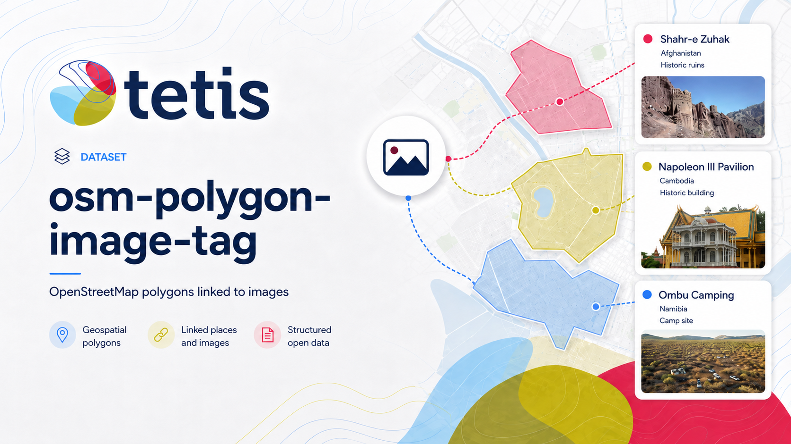

# OSM Polygon Image Tag

[](https://github.com/NoeFlandre/osm-polygon-image-tag/actions/workflows/ci.yml)
[](https://github.com/NoeFlandre/osm-polygon-image-tag/actions/workflows/docs.yml)

`osm-polygon-image-tag` builds a reproducible GeoParquet dataset of **closed
ways and relations** from read-only Geofabrik `.osm.pbf` files. It keeps every
original OSM tag, extracts image references, resolves provider URLs when
possible, and publishes verified artifacts to Hugging Face.

- **Docs:** <https://noeflandre.github.io/osm-polygon-image-tag/>
- **Dataset:** <https://huggingface.co/datasets/NoeFlandre/osm-polygon-image-tag>
- **Source:** <https://github.com/NoeFlandre/osm-polygon-image-tag>

## What the dataset contains

The Hugging Face dataset has two configurations:

- `polygons`: one deduplicated row per selected OSM way or relation, with
  Polygon or MultiPolygon geometry, geodesic `area_m2`, bounding box, OSM
  metadata, all original `tags`, normalized provider columns, and a
  `source_pbfs` list preserving overlapping-extract provenance.
- `image_assets`: deduplicated rows for the image references attached to those
  public features, with the exact source value, provider, canonical ID, page
  URL, direct/thumbnail URL when available, metadata, status, and resolver
  provenance.

Join the configurations on `osm_type`, `osm_id`, `osm_version`, and
`source_pbf`. Internal per-PBF shards remain private for resumability; the
published `public/` view removes repeated feature rows and remaps asset
provenance. Image bytes are not downloaded; the asset table is designed for
later retrieval and filtering.

## References selected

The extractor selects non-empty values for `image`, `wikimedia_commons`,
`mapillary`, `panoramax`, every numeric `panoramax:<n>`, `kartaview`, `flickr`,
and `bubbleid`. Similar-looking keys such as `panoramax:left` and
`image:license` are not selected. The complete selection and schema are in the
[data contract](docs/data-contract.md).

## Run or resume the pipeline

Prerequisites: Python 3.12, [uv](https://docs.astral.sh/uv/), and the `osmium`
executable. Install the locked environment:

```bash
git clone https://github.com/NoeFlandre/osm-polygon-image-tag.git
cd osm-polygon-image-tag
uv sync --locked --dev
```

Check a source tree without writing anything, then start the resumable run:

```bash
uv run osm-polygon-image-tag preflight \
  --source-root "/path/to/geofabrik-pbf" \
  --data-root "/path/to/osm-polygon-image-tag"

uv run osm-polygon-image-tag run-and-publish \
  --source-root "/path/to/geofabrik-pbf" \
  --data-root "/path/to/osm-polygon-image-tag" \
  --confirm-repo NoeFlandre/osm-polygon-image-tag
```

Run the same `run-and-publish` command to resume. Fast resume reuses finalized
shards and historical asset enrichment without reopening completed PBFs. Press
Ctrl-C once and wait; the next run continues from the last finalized boundary.
The source tree is always read-only, and all writes stay under `--data-root`.

Authenticate with `hf auth login` before publishing. Mapillary direct URLs need
`MAPILLARY_ACCESS_TOKEN`; Flickr keys are optional and unavailable to free
accounts. Without provider credentials, the pipeline preserves factual
page-only results and revisits improvable rows when credentials are later
provided. See [operations](docs/operations.md) for credential setup and
progress events.

## Output layout

The managed data root contains deterministic, independently resumable shards:

```text
data/             polygon GeoParquet shards
manifests/        polygon identities and counts
assets/           internal image-asset shards, map, and hero image
asset-manifests/  enrichment checkpoints
public/            deduplicated Parquet files published to Hugging Face
statistics/       generated factual statistics
README.md         generated dataset card
cache/            private resolution cache + H3 map cache
                  (never published to the Hub)
```

The dataset card embeds a static PNG `assets/geographic_polygon_density.png`
that visualizes the count of deduplicated public `polygons` rows per H3 cell.
The map is generated by `build_geographic_map` from finalized polygon
shards only, with H3 resolution 3, logarithmic `magma` scale, geometry-
centroid assignment, and Natural Earth 1:110m landmass context; the
raw PBF source tree is never opened during metadata generation.

## Documentation and development

- [Getting started](docs/getting-started.md)
- [CLI reference](docs/cli.md)
- [Architecture](docs/architecture.md)
- [Data contract](docs/data-contract.md)
- [Operations and credentials](docs/operations.md)
- [Development and contribution](docs/development.md)

Run the complete local quality gate with `just ci`; build the docs locally with
`just docs`. The project uses `uv`, Ruff, ty, pytest, pre-commit, Just, Typer,
Rich, tqdm, and GitHub Actions.

## License

Pipeline source code is Apache-2.0. OpenStreetMap-derived data is subject to
the Open Database License (ODbL); the generated dataset card carries the
required OpenStreetMap and Geofabrik attribution.

## Citation

If you use this pipeline or its generated dataset, please cite **Noé Flandre,
OSM Polygon Image Tag, version 0.1.0**. The machine-readable citation metadata
is available in [`citation.cff`](citation.cff).
